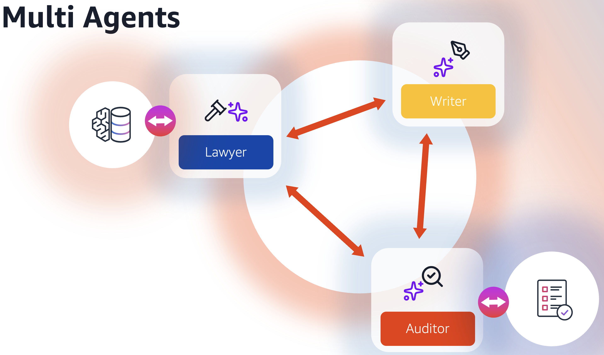
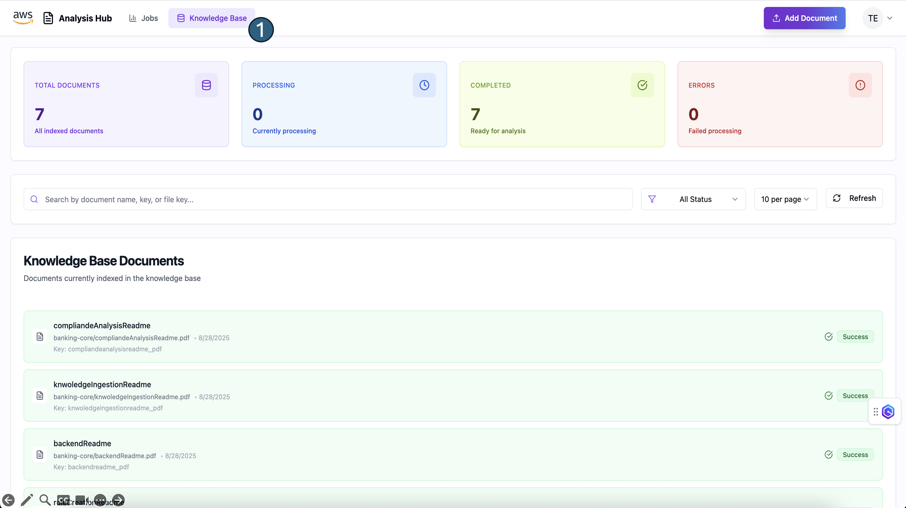
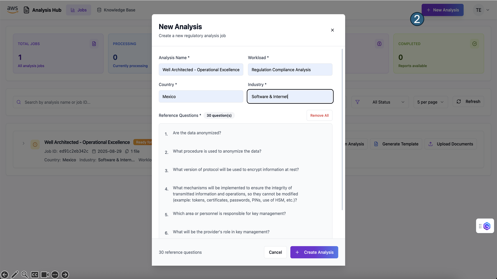
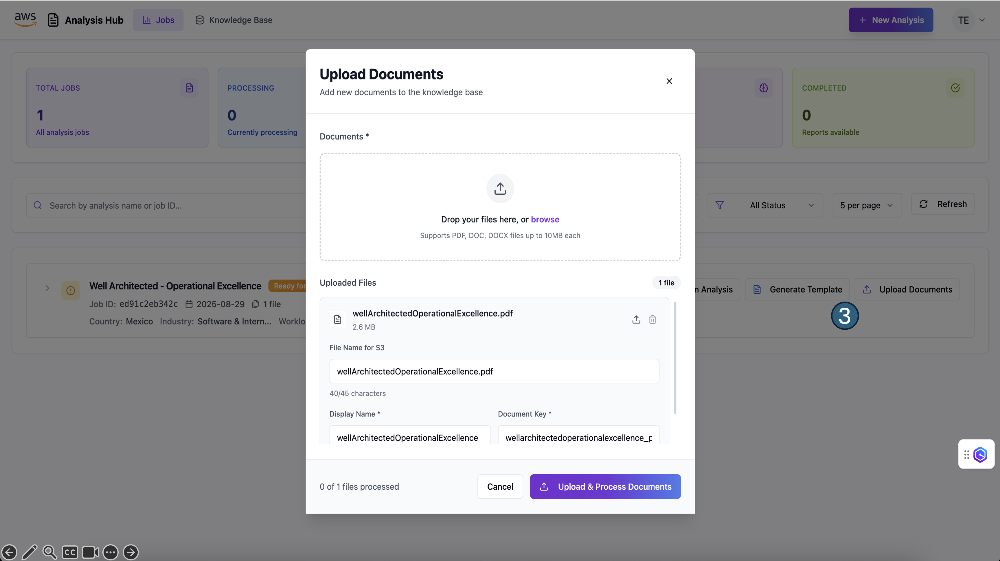
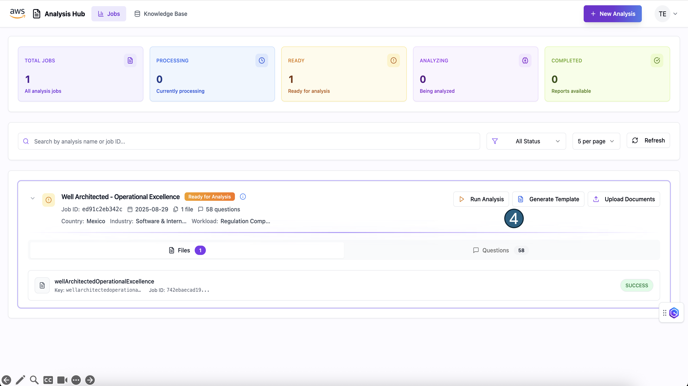
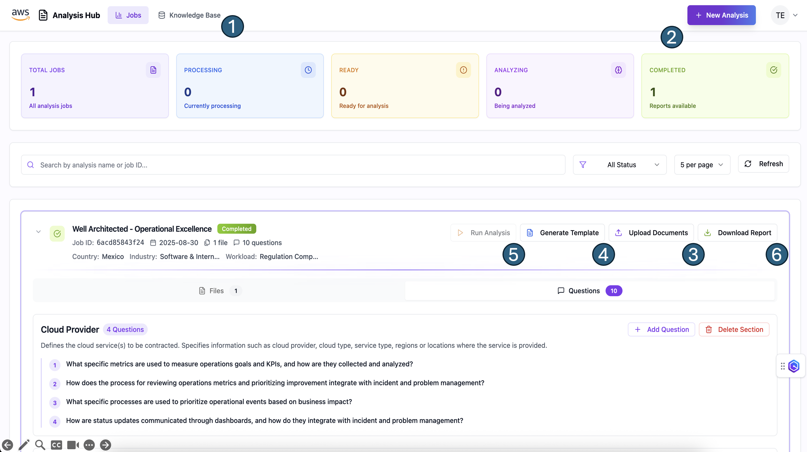

# Multi-Agent Compliance Analysis System

A comprehensive AWS-based system that uses AI agents to perform regulatory compliance analysis on documents. The system processes documents through multiple specialized agents (lawyer, writer, and auditor) to generate detailed compliance reports.

## Overview

The Multi-Agent Compliance Analysis System blueprint is designed to automate and streamline regulatory compliance assessment for complex organizational workloads. This system addresses the critical challenge of ensuring adherence to ever-evolving regulatory frameworks by leveraging the power of artificial intelligence and multi-agent collaboration.

The system employs a collaborative multi-agent architecture to perform comprehensive compliance analysis. This approach leverages specialized AI agents that work together to analyze organizational workloads against regulatory requirements through an iterative question-and-answer process backed by a comprehensive knowledge base.



### Incorporating multiple perspectives for regulatory question answering

The Lawyer agent ([details can be found here](./backend/agents/README.md)) relies on a specialized knowledge base ([whose details are found here](./backend/knowledge_ingestion_stack/README.md)) to obtain information about a query from a specific perspective.

For instance a query like:

*"Is the application data encrypted?"*

can yield different answers depending on who is answering it. From a Chief Data Officer the answer may be:

*"Only PII or critical data is encrypted following standard procedures"*

meanwhile a Security Engineer may answer something like:

*"There are two levels of encryption depending on the sensitivity of the data. For non-sensitive data simple encryption protocols are used while for critically sensitive data a multi-stage encryption mechanism is used"*

Different perspectives will yield different, and often complementary answers. Seeking out multiple perspectives for a same query can help enrich the breadth and depth of information obtained.

You may customize the perspectives the lawyer agent seeks out to answer the auditor's queries by modifying the AnalysisPerspectives and AnalysisPersonas objects in [./backend/shared/analysis_lenses](./backend/shared/analysis_lenses/) according to your needs.

## Architecture

The following diagram briefly describes the AWS services used in this prototype and how they interact with each other


Deploying this CDK stack will provision a backend that by using AWS Lambda functions and Amazon Bedrock will help you analyze the compliance of a workload against regulatory documents or guidelines. The following diagram illustrates the services and infrastructure deployed by this stack.

## Folder structure

This blueprint is organized as follows:

```
blueprints/genai-marketing-campaigns
|---backend # Backend of the blueprint
|---frontend # UI of the application
|---readme_assets
```

## Getting started

> **Warning**
> This sample allows you to interact with models from third party providers. Your use of the third-party generative AI (GAI) models is governed by the terms provided to you by the third-party GAI model providers when you acquired your license to use them (for example, their terms of service, license agreement, acceptable use policy, and privacy policy).

> You are responsible for ensuring that your use of the third-party GAI models comply with the terms governing them, and any laws, rules, regulations, policies, or standards that apply to you.

> You are also responsible for making your own independent assessment of the third-party GAI models that you use, including their outputs and how third-party GAI model providers use any data that might be transmitted to them based on your deployment configuration. AWS does not make any representations, warranties, or guarantees regarding the third-party GAI models, which are “Third-Party Content” under your agreement with AWS. This sample is offered to you as “AWS Content” under your agreement with AWS.

This project consists of four main components that must be deployed in a specific order:

1. [**backend**](backend/README.md) - The backend of the application. Creates the required infrastructure and deploys it to AWS.
2. [**frontend**](frontend/README.md) - The UI of the application.

Please refer to the corresponding README files for deployment instructions of each component.

**Note:** Please make sure the following models are available in your region of deployment

* Anthropic Claude 3.7 Sonnet
* Amazon Nova Pro
* Amazon Nova Lite

You can review the availability of models by regions in: [https://docs.aws.amazon.com/bedrock/latest/userguide/models-regions.html](https://docs.aws.amazon.com/bedrock/latest/userguide/models-regions.html)

## Usage

To analyze the compliance of a workload follow these steps:

1. **Populate the knowledge base:** On the UI click on the "Knowledge Base" tab and then select "Add Document". Follow the steps in the model to add a new document and wait until it is indexed.
2. **Create an analysis job:** On the UI click on the "Jobs" tab and then click on the "New Analysis" button. Fill out the job information. You may also modify the reference questions (see [Question Alignment with Reflexion Technique](./backend/knowledge_ingestion_stack/README.md#1-Regulation-Question-Generation-Module)) in order to tailor the question generation task to your needs.
3. **Upload regulation/guideline/law documents to your analysis for question generation:** On the UI select your analysis and click on the "Upload Documents" button. Upload each regulation document to be used for the analysis. The documents used for your compliance analysis will appear on the "Files" section of your analysis.
4. **Generate a template for your report:** On the UI select your analysis and click on the "Generate Template" button. You may use the default template or upload a custom JSON template. In this step the questions generated from the regulation will be mapped to sections under the template. Once finished, the generated questions grouped by section will appear on the "Questions" section of your analysis. You are free to edit the questions and sections on the generated template before starting the analysis.
5. **Start your compliance analysis:** On the UI select your analysis and click on the "Run Analysis" button. This will initiate the multi-agent collaboration loop to generate the compliance analysis and report. The execution time varies depending on the number of sections and the number of questions per section defined in the template. On average, *a 5 question section will take roughly 3 minutes to complete*.
6. **Download the compliance assessment:** Once the analysis is finished (Completed status) download your assessment by clicking on the "Download report" button.







### Customizing the application

To customize the application to your needs you only have to define the perspectives for the regulatory question-answering process in the [./backend/shared/analysis_lenses/user_analysis_mapping.py](./backend/shared/analysis_lenses/user_analysis_mapping.py) file.

You must also customize or define the types of documents the application is expected to process. Such definitions can be found in [./backend/shared/analysis_lenses/document_types.py](./backend/shared/analysis_lenses/document_types.py) file.

### Sample data for testing

Alongside this blueprint we provide sample data for you to test the application. 

The sample data consists of all the README files of this blueprint (as .pdf files) for the knowledge base population on one hand, and the AWS Well Architected Operational Excellence PDF guide for the compliance analysis on the other hand. Additionally, we provide a custom sample report template.

The provided sample data can be used to assess whether this workload is compliant against the operational excellence pillar of [AWS well-architected framework](https://aws.amazon.com/architecture/well-architected/).

The sample data can be found in the 

```bash
/sample_data
```

folder.

## A note regarding multilanguage support

This application supports multiple languages out-of-the-box. This is achieved by leveraging the multilanguage capabilities of the LLMs used by the application. The LLMs are instructed, within the prompt, to execute their tasks in the language of the input documents. While this is very useful for prototyping we encourage end-users to consider proper localization techniques when deploying the application into production.

The list of supported languages is [found here](https://docs.aws.amazon.com/nova/latest/userguide/what-is-nova.html#:~:text=1%3A%20Optimized%20for%20these%2015%20languages%3A%20English%2C%20German%2C%20Spanish%2C%20French%2C%20Italian%2C%20Japanese%2C%20Korean%2C%20Arabic%2C%20Simplified%20Chinese%2C%20Russian%2C%20Hindi%2C%20Portuguese%2C%20Dutch%2C%20Turkish%2C%20and%20Hebrew.)

## Security Guideline
Please see the [security guidelines](readme_assets/security.md).

## Content Security Legal Disclaimer
The sample code; software libraries; command line tools; proofs of concept; templates; or other related technology (including any of the foregoing that are provided by our personnel) is provided to you as AWS Content under the AWS Customer Agreement, or the relevant written agreement between you and AWS (whichever applies). You should not use this AWS Content in your production accounts, or on production or other critical data. You are responsible for testing, securing, and optimizing the AWS Content, such as sample code, as appropriate for production grade use based on your specific quality control practices and standards. Deploying AWS Content may incur AWS charges for creating or using AWS chargeable resources, such as running Amazon EC2 instances or using Amazon S3 storage.

## Operational Metrics Collection
We may collect anonymous operational metrics, including: the region a blueprint is deployed, the name and version of the blueprint deployed, and related information. We may use the metrics to maintain, provide, develop, and improve the constructs and AWS services.