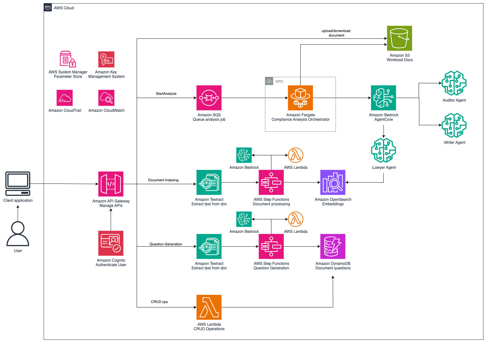

# Multi-Agent Compliance Analysis System

A comprehensive AWS-based system that uses AI agents to perform regulatory compliance analysis on documents. The system processes documents through multiple specialized agents (lawyer, writer, and auditor) to generate detailed compliance reports.

## Overview

The Multi-Agent Compliance Analysis System is an enterprise-grade solution designed to automate and streamline regulatory compliance assessment for complex organizational workloads. This system addresses the critical challenge of ensuring adherence to ever-evolving regulatory frameworks by leveraging the power of artificial intelligence and multi-agent collaboration.

### What It Does

The system ingests and analyzes your organizational assets—including technical documentation, process manuals, code repositories, operational procedures, and policy documents—against comprehensive regulatory requirements such as industry standards, government regulations, compliance frameworks, and legal guidelines. Rather than relying on manual review processes that are time-intensive and prone to human error, the system employs three specialized AI agents that work in concert to provide thorough, consistent, and actionable compliance assessments.

### How It Works

The platform operates through a sophisticated multi-stage workflow:

1. **Document Ingestion & Processing**: Your organizational documents are automatically processed using advanced text extraction and intelligent parsing to create a searchable knowledge base
2. **Regulatory Analysis**: The system analyzes regulatory documents to generate targeted compliance questions and assessment criteria
3. **Multi-Agent Assessment**: Three specialized AI agents collaborate to evaluate compliance:
   - **Lawyer Agent**: Provides legal interpretation and regulatory analysis
   - **Writer Agent**: Generates comprehensive, readable compliance reports
   - **Auditor Agent**: Performs verification and quality assurance of findings
4. **Report Generation**: Detailed compliance reports are produced with specific findings, recommendations, and remediation guidance

### Key Benefits

- **Scalability**: Process large volumes of documentation across multiple regulatory frameworks simultaneously
- **Consistency**: Eliminate variability in compliance assessments through standardized AI-driven analysis
- **Speed**: Reduce compliance review cycles from weeks to hours
- **Accuracy**: Leverage specialized AI agents trained for legal, writing, and auditing tasks
- **Traceability**: Maintain detailed audit trails of all compliance assessments and decisions
- **Cost Efficiency**: Significantly reduce the manual effort required for compliance reviews

### Use Cases

This system is ideal for organizations that need to:
- Assess compliance with industry regulations (SOX, HIPAA, GDPR, PCI-DSS, etc.)
- Evaluate adherence to internal policies and procedures
- Prepare for regulatory audits and inspections
- Maintain ongoing compliance monitoring programs
- Analyze the compliance impact of system changes or new implementations 

## Technical Approach

The system employs a collaborative multi-agent architecture to perform comprehensive compliance analysis. This approach leverages specialized AI agents that work together to analyze organizational workloads against regulatory requirements through an iterative question-and-answer process backed by a comprehensive knowledge base.


**Auditor Agent**: Analyzes compliance status and generates assessments

**Lawyer Agent**: Provides legal expertise and answers compliance questions

**Writer Agent**: Creates comprehensive compliance reports and documentation


### Collaborative Workflow

The agents operate in a closed-loop iterative process designed to ensure thorough compliance analysis:

1. **Initial Analysis Phase**
   - The **Lawyer Agent** receives the initial set of compliance questions
   - Queries the knowledge base to gather relevant information and evidence
   - Provides detailed answers based on available organizational documentation

2. **Report Generation Phase**
   - The **Writer Agent** processes the question-answer pairs from the previous step
   - Compiles a structured Markdown report containing all gathered evidence
   - Organizes findings in a clear, auditable format

3. **Assessment and Validation Phase**
   - The **Auditor Agent** reviews both the questions and the generated report
   - Evaluates whether sufficient information exists for a compliance determination
   - **If sufficient**: Produces final compliance assessment with findings and recommendations
   - **If insufficient**: Generates follow-up questions and returns to step 1

4. **Iterative Refinement**
   - The process repeats until the Auditor Agent determines sufficient information is available
   - Each iteration deepens the analysis and fills information gaps
   - Final output includes comprehensive compliance assessment with full audit trail

### Technical Benefits

- **Specialization**: Each agent focuses on its core competency (legal research, writing, auditing)
- **Iterative Improvement**: Closed-loop process ensures comprehensive coverage
- **Scalability**: Can handle multiple regulatory frameworks simultaneously
- **Traceability**: Complete audit trail of questions, answers, and decisions
- **Consistency**: Standardized approach across different compliance assessments

## Deployment instructions

## Prerequisites

Before starting the deployment, ensure you have:

- **AWS CLI v2** - Configured with appropriate credentials  
  *[Installation Guide →](https://docs.aws.amazon.com/cli/latest/userguide/getting-started-install.html)*

- **AWS CDK Toolkit v2** - `npm install -g aws-cdk`  
  *[Installation Guide →](https://docs.aws.amazon.com/cdk/v2/guide/getting_started.html)*

- **Python 3.12+** - For CDK and application code  
  *[Download →](https://www.python.org/downloads/)*

- **Docker** - For container image building  
  *[Installation Guide →](https://docs.docker.com/get-docker/)*

- **Node.js 20+** - Required by CDK  
  *[Download →](https://nodejs.org/en/download/)*

**Note:** Please make sure the following models are available in your region of deployment

* Anthropic Claude 3.7 Sonnet
* Amazon Nova Pro
* Amazon Nova Lite

### Python Environment Setup

Create and activate a Python virtual environment, then install the required dependencies:

```bash
# Create a virtual environment
python3 -m venv venv

# Activate the virtual environment
# On macOS/Linux:
source venv/bin/activate
# On Windows:
# venv\Scripts\activate

# Upgrade pip to latest version
pip install --upgrade pip

# Install required dependencies
pip install -r requirements.txt
```

**Note**: Keep the virtual environment activated throughout the deployment process. You can deactivate it later with:
```bash
deactivate
```

### Bootstrap CDK (First Time Only)

If you haven't used CDK in your AWS account/region before:

```bash
cdk bootstrap
```

## Backend structure

This project consists of four main components that must be deployed in a specific order:

1. [**AgentCore IAM Role Stack**](agentcore_iam_role_stack/README.md) - Creates the necessary IAM role for Bedrock AgentCore
2. [**Agents**](agents/README.md) - Deploys three specialized AI agents (lawyer, writer, auditor)
3. [**Knowledge Ingestion Stack**](knowledge_ingestion_stack/README.md) - Document processing and knowledge extraction pipeline
4. [**Compliance Analysis Stack**](compliance_analysis_stack/README.md) - Multi-agent compliance analysis workflow

Please refer to the corresponding README files for deployment instructions of each component.

## System Capabilities

Once deployed, the system provides:

### Document Processing
- **Text Extraction** - Using Amazon Textract
- **Intelligent Chunking** - Context-aware document segmentation
- **Vector Embeddings** - For semantic search and retrieval
- **Metadata Generation** - AI-powered document analysis

### AI Agents
- **Lawyer Agent** - Compliance analysis and regulatory interpretation
- **Writer Agent** - Report generation and content creation
- **Auditor Agent** - Compliance verification and assessment

### Workflows
- **Document Indexing** - Process and store documents for search
- **Question Generation** - Create compliance questions from regulations
- **Compliance Analysis** - Multi-agent assessment workflow

### APIs
- **RESTful Endpoints** - Document upload, job management, report retrieval
- **Authentication** - AWS Cognito integration
- **Real-time Status** - Job tracking and progress monitoring


## Architecture

The following diagram briefly describes the AWS services used in this prototype and how they interact with each other



Deploying this CDK stack will provision a backend that by using AWS Lambda functions and Amazon Bedrock will help you analyze the compliance of a workload against regulatory documents or guidelines. The following diagram illustrates the services and infrastructure deployed by this stack.

### AWS Services Used

- **Amazon API Gateway** - Entry point service that manages and routes API requests from client applications to backend services. API Gateway is used in this prototype to manage the APIs used to interact with the backend.  
  *[Documentation →](https://aws.amazon.com/api-gateway/)*

- **Amazon Cognito** - Identity management service providing user authentication, authorization, and access control. Cognito is used in this prototype to manage the users and their access to the prototype's resources.  
  *[Documentation →](https://aws.amazon.com/cognito/)*

- **Amazon S3** - Scalable object storage for files, documents, and static content with high durability and availability. S3 is used in this prototype to store the documents uploaded by the user as well as the generated documents.  
  *[Documentation →](https://aws.amazon.com/s3/)*

- **Amazon SQS** - Managed message queuing service for decoupling applications and handling asynchronous processing. Amazon SQS is used in this prototype to send messages to the Fargate analysis job.  
  *[Documentation →](https://aws.amazon.com/sqs/)*

- **Amazon Fargate** - Serverless container platform that runs containerized applications without managing underlying infrastructure. Fargate is used in this prototype to run the compliance analysis jobs.  
  *[Documentation →](https://aws.amazon.com/fargate/)*

- **Amazon Textract** - AI-powered service that extracts text, tables, and form data from scanned documents and images. Amazon Textract is used in this prototype to parse the PDF documents into raw text.  
  *[Documentation →](https://aws.amazon.com/textract/)*

- **AWS Step Functions** - Workflow orchestration service that coordinates multiple AWS services into business processes. Step Functions is used in this prototype to orchestrate the different workflows used to index documents and create questions.  
  *[Documentation →](https://aws.amazon.com/step-functions/)*

- **Amazon OpenSearch Serverless** - Distributed and serverless search and analytics engine for indexing, searching, and analyzing large datasets. OpenSearch Serverless is used in this prototype to index the processed documentation into the knowledge base.  
  *[Documentation →](https://aws.amazon.com/opensearch-service/features/serverless/)*

- **Amazon DynamoDB** - Fast, flexible NoSQL database service for applications requiring single-digit millisecond latency. DynamoDB is used in this prototype to store the statuses of the multiple steps/stages of the analysis and to store metadata about the analysis jobs.  
  *[Documentation →](https://aws.amazon.com/dynamodb/)*

- **AWS Lambda** - Event-driven serverless compute service that runs code without provisioning or managing servers. Lambda functions handle various processing tasks throughout the system.  
  *[Documentation →](https://aws.amazon.com/lambda/)*

- **Amazon Bedrock AgentCore** - Orchestration service for building and managing AI agents using foundation models. Bedrock AgentCore is used in this prototype to manage the three agents used for the analysis task.  
  *[Documentation →](https://aws.amazon.com/bedrock/agentcore/)*

- **Amazon Bedrock** - Fully managed service providing access to foundation models for generative AI applications. Bedrock is used in this prototype to invoke the LLMs used for the processing of the documents and the analysis tasks.  
  *[Documentation →](https://aws.amazon.com/bedrock/)*

- **VPC (Virtual Private Cloud)** - Isolated network environment within AWS for secure resource deployment and network control. VPC is used in this prototype to deploy the Fargate service.  
  *[Documentation →](https://aws.amazon.com/vpc/)*

## Cost estimate

*Processing 100 documents/month, 100 pages per report, 500 tokens per page*

| Service Name | Use of the Service | Cost |
|--------------|-------------------|------|
| **Amazon Bedrock** | Foundation models for 3 AI agents (lawyer, writer, auditor) - Anthropic Claude 3.7 Sonnet, ~15,000 invocations, 5K input + 1K output tokens | $400-600 |
| **Amazon Bedrock** | Foundation models for question generation from regulation - Amazon Nova Pro, ~1,000 invocations, 15K input + 1K output tokens | $25-30 |
| **Amazon Bedrock** | Foundation models for document processing of indexed documents - ~15,000 invocations, 15K input + 3K output tokens | $115-120 |
| **Amazon OpenSearch Serverless** | Vector search and knowledge base storage for document retrieval and semantic search | $260 |
| **VPC & Networking** | Private VPC with endpoints for DynamoDB and S3, NAT Gateway for secure communication | $45 |
| **Amazon API Gateway** | REST APIs for document upload, job status, and report retrieval (~10,000 requests) | $35 |
| **Amazon Fargate** | Containerized multi-agent workflow processing (1024 MiB, ~50 vCPU-hours) | $15 |
| **Amazon Textract** | PDF text extraction from documents (10,000 pages total) | $15 |
| **Amazon DynamoDB** | Job tracking and metadata storage (~100K read/write operations) | $1 |
| **Amazon Cognito** | User authentication and authorization for API access | $1 |
| **AWS Lambda** | Orchestration functions for document processing and workflow management | $180 |
| **Amazon S3** | Document storage (input docs + generated reports, ~15GB total) | $1 |
| **Amazon SQS** | Message queuing for job coordination between services | $1 |
| **AWS KMS** | Encryption keys for SQS messages and data at rest | $1 |
| **Amazon SNS** | Notifications for Textract job completion | $1 |
| **AWS Step Functions** | Workflow orchestration for document indexing and question generation | $1 |

#### **Total Estimated Monthly Cost: ~$1100 - $1300**

### Cost Breakdown by Category (assuming a mean cost of $1200):
- **AI/ML Services**: $660 avg (55%)
- **Compute & Storage**: $458 (38%)
- **Networking & Security**: $82 (6%)
- **Application Integration**: $2 (1%)

### Key Notes:
- Bedrock costs vary significantly based on model choice (Claude 3.5 Sonnet vs Haiku)
- OpenSearch Serverless is the second-largest cost driver
- Costs scale linearly with document volume
- Additional 20-30% buffer recommended for production workloads

### Cost Optimization

- Lambda functions with appropriate memory allocation
- S3 lifecycle policies for document storage
- DynamoDB on-demand billing
- OpenSearch Serverless for cost-effective search

## Troubleshooting

### Common Issues

**CDK Bootstrap Required**
```bash
cdk bootstrap
```

**Agent Deployment Fails**
- Verify AgentCore CLI is installed: `pip install agentcore`
- Check IAM role permissions
- Ensure Docker is running

**Resource Dependencies**
- Deploy components in the specified order
- Verify all ARNs are correct
- Check AWS service quotas

**Permission Errors**
- Verify AWS credentials have sufficient permissions
- Check IAM roles and policies
- Review VPC endpoint configurations

### Getting Help

1. **Check CloudFormation Events** - Detailed error messages
2. **Review CloudWatch Logs** - Application-level errors
3. **Verify Prerequisites** - Ensure all requirements are met
4. **Check Service Quotas** - AWS account limits

## Security Considerations

- All resources use least-privilege IAM policies
- VPC isolation for sensitive workloads
- KMS encryption for data at rest and in transit
- VPC endpoints for secure AWS service access
- Container security with non-root execution
- API authentication via AWS Cognito

## Cleanup

To remove all resources, delete stacks in reverse order:

```bash
# 1. Delete compliance analysis stack
cd compliance_analysis_stack/cdk
cdk destroy MultiAgentComplianceAnalysis

# 2. Delete knowledge ingestion stack
cd ../../knowledge_ingestion_stack/cdk
cdk destroy dataIngestionBackend

# 3. Delete agents (using AgentCore CLI)
bedrock-agentcore-control delete-agent-runtime compliance_analysis_writer_agent
bedrock-agentcore-control delete-agent-runtime compliance_analysis_auditor_agent
bedrock-agentcore-control delete-agent-runtime compliance_analysis_lawyer_agent

# 4. Delete AgentCore IAM role stack
cd ../../agentcore_iam_role_stack
cdk destroy AgentCoreIAMStack
```