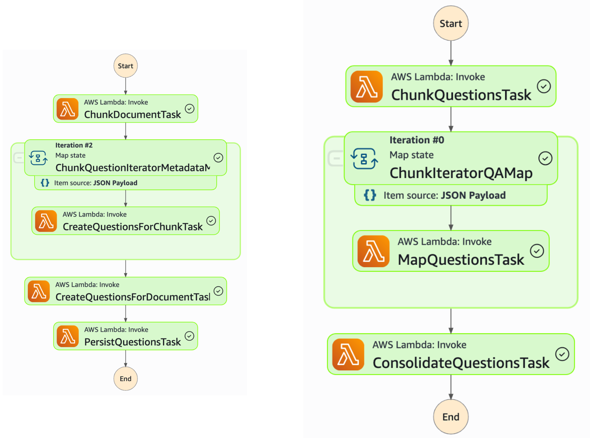
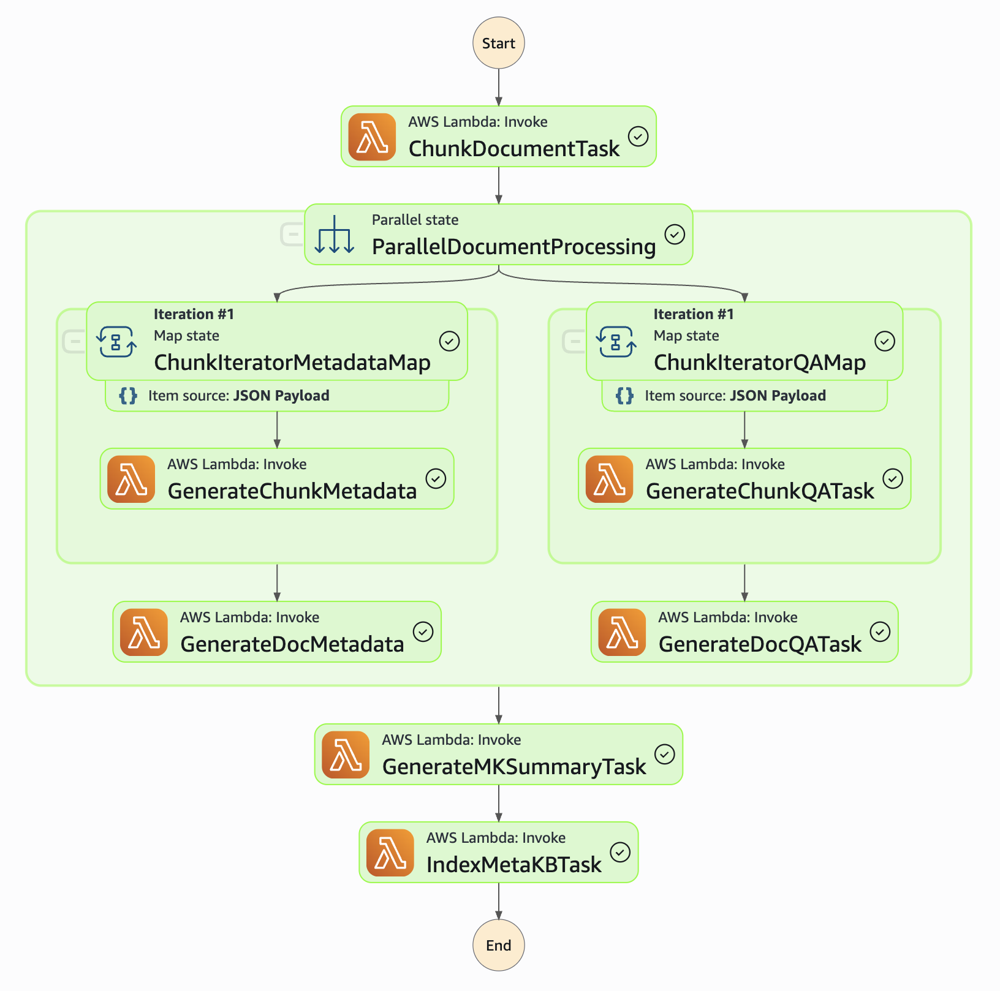

# Knowledge Ingestion Stack - Deployment Guide

This CDK stack deploys a comprehensive document processing and compliance analysis system with AI-powered knowledge extraction capabilities.

## Components

This stack deploys a comprehensive intelligent document processing (IDP) system with two main components:

### 1. Regulation Question Generation Module

Generates targeted compliance questions from regulation documents.

**Document Processing Pipeline**
- Partitions regulation documents into manageable chunks
- Generates compliance-focused questions for each partition
- Consolidates questions into comprehensive question sets
- Groups questions by compliance sections using user-defined templates

**Question Alignment with Reflexion Technique**
The system uses the [Reflexion method](https://arxiv.org/abs/2303.11366) to ensure questions probe specific organizational processes rather than general regulatory concepts:

1. **Initial Generation**: AI generates preliminary questions from regulation text
2. **Self-Evaluation**: System evaluates question quality and relevance
3. **Reflection**: AI identifies improvements needed for better process-focused questions
4. **Refinement**: Questions are revised to target specific organizational compliance aspects
5. **Iteration**: Process repeats until questions effectively probe business processes



This approach generates questions that uncover actionable compliance information rather than theoretical regulatory knowledge.

### 2. Advanced Knowledge Base Implementation

Implements a [sophisticated RAG system using Meta-Knowledge Retrieval](https://www.amazon.science/publications/meta-knowledge-for-retrieval-augmented-large-language-models) for enhanced document understanding:

**Enhanced RAG Architecture**
- Uses "prepare-then-rewrite-then-retrieve-then-read" framework
- Creates multiple perspective-based knowledge bases to reduce noise
- Generates synthetic Q&A pairs and metadata for each document chunk
- Implements Meta Knowledge Summaries (MK Summary) for document clusters

**Processing Pipeline**
1. Documents are partitioned into semantic chunks
2. Synthetic question-answer pairs are generated for each chunk
3. Metadata is extracted to enable perspective-based retrieval
4. All data is consolidated into searchable vector embeddings



This approach enables domain expert-level understanding and personalized query responses based on user perspective and role.

## Deploy the Stack

### Prerequisites

Before deploying, ensure you have:

- **AWS CLI** configured with appropriate permissions
- **Docker** installed and running
- **Python 3.12+** with pip
- **A CDK bootstrapped** AWS account
- **A Python virtual environment** with the dependencies installed
- **A Bedrock AgentCore execution role ARN** stored in the environment variable $AGENT_CORE_ROLE_ARN

Since this stack pulls Docker images from the [AWS ECR Public registry](https://docs.aws.amazon.com/AmazonECR/latest/public/public-registry-auth.html) you need to log in into it.

```
aws ecr-public get-login-password --region us-east-1 | docker login --username AWS --password-stdin public.ecr.aws
```

### Deployment with default parameters

```bash
cd cdk

# Deploy with required parameters
cdk deploy dataIngestionBackend \
  --parameters IAMAgentCoreExecutionRoleARN=$AGENT_CORE_ROLE_ARN \
  --require-approval=never

export KNOWLEDGE_INGESTION_STACK_NAME="dataIngestionBackend"
```

#### Configuration Parameters

| Parameter | Default | Description |
|-----------|---------|-------------|
| `PagesChunk` | 5 | Pages per chunk for regular documents |
| `QuestionsChunk` | 20 | Max questions per chunk for regular docs |
| `RegulationPagesChunk` | 30 | Pages per chunk for regulation documents |
| `RegulationQuestionsChunk` | 20 | Max questions per chunk for regulations |
| `IAMAgentCoreExecutionRoleARN` | **Required** | ARN of the AgentCore execution role |

### Deployment with custom configuration

```bash
cd cdk

cdk deploy dataIngestionBackend \
  --parameters IAMAgentCoreExecutionRoleARN=$AGENT_CORE_ROLE_ARN \
  --parameters PagesChunk=10 \
  --parameters QuestionsChunk=15 \
  --parameters RegulationPagesChunk=50 \
  --parameters RegulationQuestionsChunk=25 \
  --require-approval=never

export KNOWLEDGE_INGESTION_STACK_NAME="dataIngestionBackend"

```

### Stack Outputs

After successful deployment, you'll receive:

- **API Endpoints** - Document indexing, question generation, compliance reports
- **S3 Bucket ARNs** - Document storage and reports
- **DynamoDB Table Names** - Job tracking and metadata storage
- **OpenSearch Collection Endpoint** - Vector search capabilities
- **Cognito User Pool** - Authentication service

### Verify Deployment Status
```bash
aws cloudformation describe-stacks --stack-name dataIngestionBackend
```

## Troubleshooting

### Common Issues

**CDK Bootstrap Required**
```bash
cdk bootstrap
```

**Docker Not Running**
- Ensure Docker is running for Lambda packaging
- Check Docker daemon status

**IAM Permissions**
- Verify AWS credentials have sufficient permissions
- Check CloudFormation, Lambda, S3, DynamoDB, OpenSearch permissions

**AgentCore Role Missing**
- Deploy AgentCore stack first
- Verify the IAM role ARN is correct

**Region Consistency**
- Ensure all resources deploy to the same AWS region
- Check AWS CLI default region: `aws configure get region`

### Resource Limits

Be aware of these AWS service quotas:
- OpenSearch Serverless collections per account
- Lambda concurrent executions
- API Gateway request limits
- DynamoDB read/write capacity

### Support

For issues or questions:
1. Check CloudFormation events for detailed error messages
2. Review CloudWatch logs for Lambda function errors
3. Verify all prerequisites are met
4. Ensure AgentCore dependencies are deployed first

## Cleanup

To remove all resources:

```bash
cdk destroy dataIngestionBackend
```