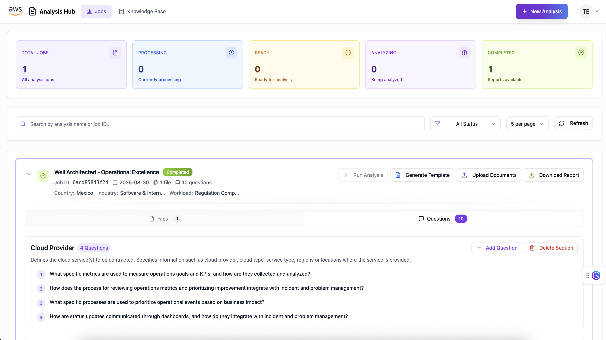

# AI Document Assistant

This repository contains a web application (frontend) for the GenAI-based marketing campaign creation assistance use-case.

It was built with [Vite](https://vitejs.dev/) + [React](https://react.dev/). For security reasons we do not provide a deployment stack, but you can run it locally.

The UI has a wizard-like interface for step-by-step campaign creation and help you with meta-prompting and will look like the one bellow.



## Requirements

In order to run this UI, you need to have installed:

- AWS CLI. Refer to [Installing the AWS CLI](https://docs.aws.amazon.com/cli/latest/userguide/cli-chap-install.html)
- AWS Credentials configured in your environment. Refer to
  [Configuration and credential file settings](https://docs.aws.amazon.com/cli/latest/userguide/cli-configure-files.html)
- Node >= 20.x.x
- [pnpm](https://pnpm.io/) - Fast, disk space efficient package manager
- AWS CDK. Refer to [Getting started with the AWS CDK](https://docs.aws.amazon.com/cdk/v2/guide/getting_started.html)
- An existing user in the Cognito user pool created with the Data Ingestion Stack.

You also need to have the proper backend stack for your prototype deployed into your account, as well as a valid user configured in [Amazon Cognito](https://aws.amazon.com/cognito/).

---

## Developing and running locally

### Configuring your environment

In a terminal, run:

```shell
$ cd webapp/
```

Inside the `webapp/` folder, create a file named `.env`. Copy the environment displayed below and replace the property values with the outputs from your deployed backend stack.

```properties
VITE_AWS_REGION="<REGION_NAME>"
VITE_COGNITO_USER_POOL_ID="<COGNITO_USER_POOL_ID>"
VITE_COGNITO_USER_POOL_CLIENT_ID="<COGNITO_USER_POOL_CLIENT_ID>"
VITE_COGNITO_IDENTITY_POOL_ID="<COGNITO_IDENTITY_POOL_ID>"
VITE_API_GATEWAY_REST_API_ENDPOINT="<API_GATEWAY_REST_API_ENDPOINT>"
VITE_API_NAME="<API_NAME>"
VITE_APP_NAME="PACE Sample Project"
```

### Developing with dev mode

From the `webapp/` folder, you can run the following command in a terminal to run the app in development mode:

```shell
$ pnpm i
$ pnpm run dev
```

Open [http://localhost:5173/](http://localhost:5173/) to view it in your browser.

The page will reload when you make changes. You may also see any lint errors in the console.

### Developing with watch and hot reloading

In one terminal window, run:

```shell
$ pnpm run watch
```

In another window, run:

```shell
$ pnpm run preview
```

This template provides a minimal setup to get React working in Vite with HMR and some ESLint rules. It builds the app for production to the `dist` folder. It correctly bundles React in production mode and optimizes the build for the best performance.

---
