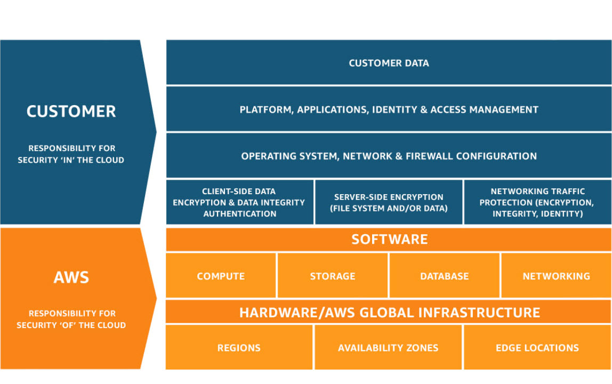

# Security

## Shared Responsibility Model

Security and Compliance is a shared responsibility between AWS and the customer.

This shared model can help relieve the customer’s operational burden as AWS operates, manages and controls the components from the host operating system and virtualization layer down to the physical security of the facilities in which the service operates.
 
The customer assumes responsibility and management of the guest operating system (including updates and security patches), other associated application software as well as the configuration of the AWS provided security group firewall. Customers should carefully consider the services they choose as their responsibilities vary depending on the services used, the integration of those services into their IT environment, and applicable laws and regulations. The nature of this shared responsibility also provides the flexibility and customer control that permits the deployment. As shown in the chart below, this differentiation of responsibility is commonly referred to as Security “of” the Cloud versus Security “in” the Cloud.

For more details, please refer to [AWS Shared Responsibility Model](https://aws.amazon.com/compliance/shared-responsibility-model/).

## Amazon Bedrock

There are three pillars when considering security of LLM applications:

- Security and Privacy of your data;
- Safety; and
- Responsibility.

Amazon Bedrock offers a host of features and controls around these three pillars. For an in-depth description please consult the service page.

We do emphasize some general recommendations:

### DoS, Bruteforcing and Noisy-neighbor threats

We recommend you monitor the usage of the service to detect anomalies that might correlate to attack attempts such as Denial-of-service, brute-force attacks or even unintended noisy-neighbor events.

As a suggestion, consider some form of rate limiting to both avoid malicious attacks and also to avoid over-consumption of the service.

### LLM Threats

LLM applications are subject to novel class of security threats, such as those described in the [OWASP Top 10 for LLM Applications](https://owasp.org/www-project-top-10-for-large-language-model-applications/).

The security considerations below are not comprehensive and as you move to production we recommend you dive deeper into both the security model of the Amazon Bedrock platform (see details in [Bedrock Security](https://docs.aws.amazon.com/bedrock/latest/userguide/security.html)) and security model for LLMs in general, such as those described by OWASP.

### Prompt injection

This manipulates a large language model (LLM) through crafty inputs, causing unintended actions by the LLM. Direct injections overwrite system prompts, while indirect ones manipulate inputs from external sources.

As a recommendation you can apply guardrails to the inputs to LLM.

This prototype uses Anthropic Claude models which have been shown by some [benchmarks](https://arxiv.org/abs/2403.02691) to be more robust against this type of attack.

### Jailbreaking

Jailbreaking is the class of attacks that attempt to subvert safety filters built into the LLMs themselves.

There is a subtle difference between Prompt Injection and Jailbreaking. See details [here](https://simonwillison.net/2024/Mar/5/prompt-injection-jailbreaking/).

### Sensitive information disclosure

LLMs may inadvertently reveal confidential data in its responses, leading to unauthorized data access, privacy violations, and security breaches. It is crucial to implement data sanitization and strict user policies to mitigate this.

It should be noted that this prototype does not allow users to directly interact with the LLM, however, malicious users may employ subversive attacks, such as purposefuly including text in JIRA tickets to confound the models. Even though we find this highly unlikely, it is important to point out this vulnerability.

### Overreliance

Systems or people overly depending on LLMs without oversight may face misinformation, miscommunication, legal issues, and security vulnerabilities due to incorrect or inappropriate content generated by LLMs.

This risk is inherent to all LLM applications. As a mitigation we suggest that you use this prototype as an assistant to a human, in order to increase productivity, but with some overseeing of the content generated.

### Guardrails

Guardrails for Amazon Bedrock provides additional customizable safeguards on top of the native protections of FMs, delivering safety protections that is among the best in the industry by:

For speed, in this prototype, we did not use Guardrails for Bedrock. You should evaluate if this is a necessary safeguard by weighing against your security posture.

### Auditing

Consider enabling model invocation logging and set alerts to ensure adherence to any responsible AI policies.

Model invocation logging is disabled by default. See [Model Invocation Logging](https://docs.aws.amazon.com/bedrock/latest/userguide/model-invocation-logging.html) for details.

## Cognito

You may change password policies
and [activate MFA](https://docs.aws.amazon.com/cognito/latest/developerguide/user-pool-settings-mfa.html) in the Cognito
User Pool.

If you activate MFA, you may also need to increase your [SNS SMS spending quota](https://docs.aws.amazon.com/sns/latest/dg/channels-sms-awssupport-spend-threshold.html).
Once the limit is reached, Cognito's MFA messages will not get delivered, and no one will be able to login.

## Encryption Keys

This project uses AWS Managed keys to encrypt resources. While this reduces the administrative burden of managing encryption keys, please consider using a Customer Managed Key (CMK) if you are subject to corporate or regulatory policies that require complete control in terms of creation, rotation, deletion as well as the access control and usage policy of encryption keys.

For more information on how to create an manage your keys, refer to [AWS Key Management Service concepts](https://docs.aws.amazon.com/kms/latest/developerguide/concepts.html).

## IAM Governance

AWS has a series of [best practices and guidelines](https://docs.aws.amazon.com/IAM/latest/UserGuide/IAMBestPracticesAndUseCases.html) around IAM.

### AWS Managed Policies

In this accelerator, we used default AWS Managed Policy to facilitate development. AWS Managed Policies don’t grant least privileges in order to cover common use cases. The best practice it to write a custom policy with only the permissions needed by the task.
More information: https://docs.aws.amazon.com/IAM/latest/UserGuide/best-practices.html#bp-use-aws-defined-policies.

### Wildcard Policies

In this accelerator, some policies use wildcards to specify resources to expedite development. The best practice is to create policies that grant least privileges.
More information: https://docs.aws.amazon.com/IAM/latest/UserGuide/best-practices.html#grant-least-privilege

## Monitoring

### Logs

Logging can become verbose in prod and too many logs can make analysis difficult. Logging can also disclose data. For
further AWS-recommended best practices,
see [Logging best practices](https://docs.aws.amazon.com/prescriptive-guidance/latest/logging-monitoring-for-application-owners/logging-best-practices.html).

### Enable AWS Config

[AWS Config](https://aws.amazon.com/config/) is a service that maintains a configuration history of your AWS resources and evaluates the configuration against best practices and your internal policies. You can use this information for operational troubleshooting, audit, and compliance use cases.

You should consider enabling AWS Config all regions in your account. 

For more details on AWS Config best practices, please refer to the [AWS Config best practices](https://aws.amazon.com/blogs/mt/aws-config-best-practices/) blog post.

### Configure CloudTrail

You automatically have access to the CloudTrail Event history when you create your AWS account. The Event history provides a viewable, searchable, downloadable, and immutable record of the past 90 days of recorded management events in an AWS Region.

We recommend that you create a trail or a CloudTrail Lake event data store for your resources extending past 90 days:

- Enable DynamoDB data plane logging
- Enable API logging

### Enable CloudWatch alarms

In Amazon Cloudwatch, you can create your own metrics and alarms. While this project does not implement any metrics, we recommend that you go over the [list of recommended Cloudwatch alarms](https://docs.aws.amazon.com/AmazonCloudWatch/latest/monitoring/Best_Practice_Recommended_Alarms_AWS_Services.html) and set up the metrics that make sense for your own use case.

## S3

Amazon S3 provides a number of security features to consider as you develop and implement your own security policies.
The following best practices are general guidelines and don’t represent a complete security solution. Because these best
practices might not be appropriate or sufficient for your environment, treat them as helpful considerations rather than
prescriptions.

For an in-depth description of best practices around S3, please refer
to [Security Best Practices for Amazon S3](https://docs.aws.amazon.com/AmazonS3/latest/userguide/security-best-practices.html).
At a minimum, we recommend that you:

1. Ensure that your Amazon S3 buckets use the correct policies and are not publicly accessible;
2. Implement least privilege access;
3. Consider encryption at-rest (on disk);
4. Enforce encryption in-transit by restricting access using secure transport (TLS);
5. Enable object versioning when applicable; and
6. Enable cross-region replication as a disaster recovery strategy;
7. Consider if the data stored in the buckets warrants enabling MFA delete.

## Configure Cross-Origin Resource Sharing (CORS)

CORS is a mechanism that uses additional HTTP headers to tell a browser to let a web application running at one origin (domain) have permission to access selected resources from a server at a different origin.

CORS is enabled to allow requests from the demo web app running locally only. In production, you should restrict it to your domain on API Gateway and the S3 input and output buckets.

## API Gateway

In this accelerator, the API has a public facing endpoint protected by AWS WAF. It only allows authorized users from Amazon Cognito. You should evaluate if you need to further protect the API endpoint using the following options:

* Restrict access to specific [Source IPs with WAF](https://repost.aws/knowledge-center/waf-allow-my-ip-block-other-ip).
* Restrict access to a specific VPC as a [private REST API](https://docs.aws.amazon.com/apigateway/latest/developerguide/apigateway-private-apis.html).

## DynamoDB

We implement encryption at rest with AWS KMS Customer Managed Keys. You may want to consider implementing client-side
encryption to further protect sensitive data.

For an in-depth description of best practices around DynamoDB, please refer
to [DynamoDB security best practices](https://docs.aws.amazon.com/amazondynamodb/latest/developerguide/best-practices-security.html).

## Lambda 

### Runtimes

This project uses AWS Lambda provided runtimes.

Lambda’s standard deprecation policy is to deprecate a runtime when any major component of the runtime reaches the end of community long-term support (LTS) and security updates are no longer available. Most usually, this is the language runtime, though in some cases, a runtime can be deprecated because the operating system (OS) reaches end of LTS.

After a runtime is deprecated, AWS may no longer apply security patches or updates to that runtime, and functions using that runtime are no longer eligible for technical support. Such deprecated runtimes are provided ‘as-is’, without any warranties, and may contain bugs, errors, defects, or other vulnerabilities.

You should periodically review and update each AWS Lambda function runtime making sure that it is in the [list of supported runtimes](https://docs.aws.amazon.com/lambda/latest/dg/lambda-runtimes.html#runtimes-supported).

### Security scans

You should periodically run security and vulnerability scans for the code, dependencies and images in your Lambda functions and Lambda layers.

You can use tools like [AWS Inspector](https://docs.aws.amazon.com/inspector/latest/user/scanning_resources_lambda_code.html) or choose your own scanning tool.

For scanning this prototype, we used [ASH - The Automated Security Helper](https://github.com/awslabs/automated-security-helper). The security helper tool was created to help you reduce the probability of a security violation in a new code, infrastructure or IAM configuration by providing a fast and easy tool to conduct preliminary security check as early as possible within your development process.

## SQS

### Attribute Based Access Control

Consider implementing Attribute Based Access Control (ABAC) to manage queue permissions at scale. ABAC should be governed by a documented tagging strategy. 

With ABAC, you can use tags to configure IAM access permissions and policies for your Amazon SQS queues, which helps you to scale your permissions management. You can create a single permissions policy in IAM using tags that you add to each business role—without having to update the policy each time you add a new resource. You can also attach tags to IAM principals to create an ABAC policy. You can design ABAC policies to allow Amazon SQS operations when the tag on the IAM user role that's making the call matches the Amazon SQS queue tag. To learn more about tagging in AWS, see AWS Tagging Strategies and Amazon SQS cost allocation tags.

### Dead-Letter Queues

You should always specify an owner to monitor dead-letter queues, alert on failures and/or redrive queues automatically when failures occur. SQS permissions can be configured with both SQS policies and IAM policies. See [Overview of Managing Access](https://docs.aws.amazon.com/AWSSimpleQueueService/latest/SQSDeveloperGuide/sqs-overview-of-managing-access.html) for more information.

## VPC

The following best practices are general guidelines and don’t represent a complete security solution. Because these best practices might not be appropriate or sufficient for your environment, treat them as helpful considerations rather than prescriptions.

- **Multi AZ:** Use multiple Availability Zone deployments so you have high availability.
- **Securing:** Use security groups and network ACLs.
- **VPC Flow Logs:** Use Amazon CloudWatch to monitor your VPC components and VPN connections.
- **Data Safety:** When working with sensitive data it is recommended to access AWS service with VPC endpoint when available.
- **Resource Isolation:** When possible, isolate the resources within a VPC different from the default and configure internet access to restrict the network to only nown hosts and destinations.
- **Limit outbound access:** Generally speaking, if a has a path to the Internet, it should not have unrestricted access to all ports and all IP addresses. Either a NACL, egress rule, or other mechanism like a routing table should limit the Internet addresses and ports that an instance can reach.

For an in-depth description of best practices around VPC, please refer
to [Security Best Practices for Amazon VPC](https://docs.aws.amazon.com/vpc/latest/userguide/vpc-security-best-practices.html).

## CDK/CloudFormation

You can prevent stacks from being accidentally deleted by enabling termination protection on the stack. If a user attempts to delete a stack  with termination protection enabled, the deletion fails and the stack, including its status, remains unchanged. For more details on how to enable the deletion protection, refer to [`termination_protection` configuration](https://docs.aws.amazon.com/cdk/api/v2/docs/aws-cdk-lib-readme.html#termination-protection).