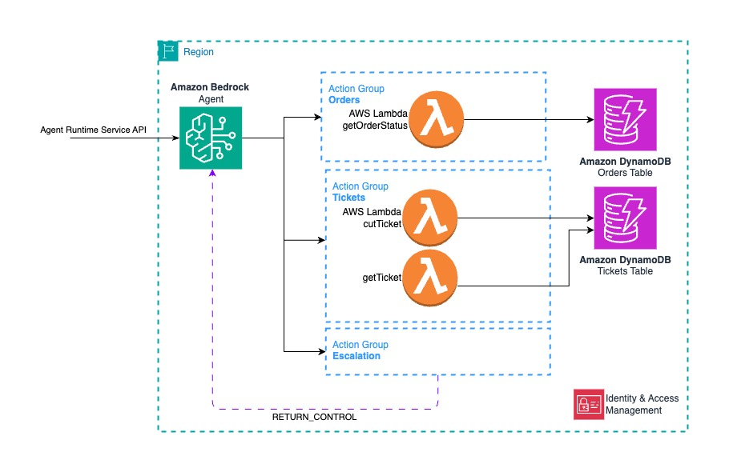
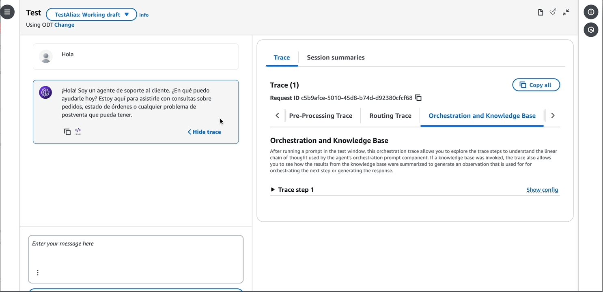
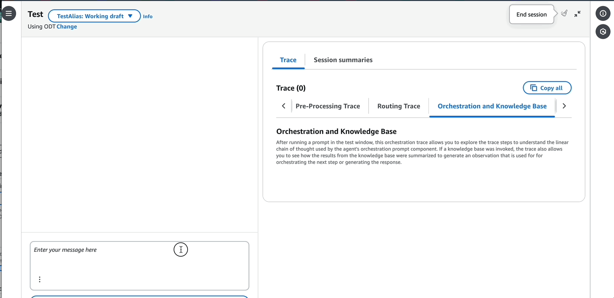

# Build a Support Agent using Amazon Bedrock

## Overview

A Support Agent is a Generative AI-powered application that enables users to interact with support systems using natural language. Instead of navigating through complex interfaces, users can simply ask questions about their orders or request support through natural conversations. The agent understands the context and automatically routes requests to the appropriate actions.

This project demonstrates how to build and deploy a Support Agent using Amazon Bedrock Agents. 

## Architecture


The agent provides three key functionalities through dedicated action groups:
1. Order Management: Get order status with order ID and RUT (national identity number)
2. Ticket Management: Create tickets and check ticket status
3. Escalation: this just signal to the application that customer wants to escalate. It uses the `RETURN_CONTROL` type of action.

The agent intelligently decides which action to take based on the conversation history and user input, making it an effective tool for customer support automation. Customer interacts with the system tru apps that use [Agent Runtime Service API](https://docs.aws.amazon.com/bedrock/latest/APIReference/API_agent-runtime_InvokeAgent.html)



The architecture follows a serverless design where the Bedrock agent orchestrates the conversation and delegates specific tasks to specialized Lambda functions. Each action group (orders and tickets) is implemented as a separate Lambda function with minimal required permissions.


The solution uses the following AWS services:
- Amazon Bedrock - For running the foundation model and agent orchestration
- AWS Lambda - For executing the action groups (orders and tickets)
- AWS IAM - For secure, least-privilege access control


We use AWS CDK For infrastructure as code deployment.

## Prerequisites

### CDK Setup
Note: If you you don't know what CDK is, please [start here](https://docs.aws.amazon.com/cdk/v2/guide/getting_started.html) and install cdk and dependencies, configure environment and boostrap your account and region.

### Cross Region Inference

[Cross Region Inference](https://aws.amazon.com/blogs/machine-learning/getting-started-with-cross-region-inference-in-amazon-bedrock/) dynamically routes LLM invocations across multiple regions. In this project, you will be using an [Inferece Profile](https://docs.aws.amazon.com/bedrock/latest/userguide/inference-profiles.html) which is resource that represent the same model ID in different regions. 

You will find this inference profile ID in [bedrock_support_agent_stack.py](./bedrock_support_agent/bedrock_support_agent_stack.py)

```python
# use an inference profile
DEFAULT_MODEL_ID    = "us.anthropic.claude-3-5-haiku-20241022-v1:0"
# Regions covered
# US East (Virginia) us-east-1,
# US East (Ohio) us-east-2,
# US West (Oregon) us-west-2
```
### Model Access

Here we are using [Anthopic Claude Haiku 3.5](https://aws.amazon.com/about-aws/whats-new/2024/11/anthropics-claude-3-5-haiku-model-amazon-bedrock/) vía Amazon Bedrock API. If you are new to Bedrock, probably you need to [enable model access](https://docs.aws.amazon.com/bedrock/latest/userguide/model-access-modify.html) for this specific model in all regions covered by the inference profile (at least the region you are deploying this)


## Deployment

This project uses AWS CDK for infrastructure deployment. Follow these steps:

Clone the repo:
```bash
git clone https://github.com/aws-samples/generative-ai-ml-latam-samples
```

Set up environment:
```bash
cd pocs/bedrock-support-agent
python3 -m venv .venv
source .venv/bin/activate  # On Windows use: .venv\Scripts\activate.bat
pip install -r requirements.txt
```

Deploy the stack:
```bash
cdk deploy
```

## Action Groups and Functions

Action groups [define what the Agent can do](https://docs.aws.amazon.com/bedrock/latest/userguide/agents-action-create.html). In this project you implmented 3 Action Groups:

1. `TicketsActionGroup`: Useful for ticket interactions, you can `cutTicket` and `getTicket` using code executed in an AWS Lambda function wich read / write a DynamoDB Table. Here you can put your own custom logic and integrate with your ticketing system. 

```python 
    if agent_helper.function == "cutTicket":
        ...
        if (rut and order_number and description):
            ticket_service = TicketService(order_number=order_number)
            response = ticket_service.cut_ticket(sessionId, rut, description)
            function_response = agent_helper.response(response)

    elif agent_helper.function == "getTicket":
        ...
        if ticket_number:
            ticket_service = TicketService(order_number=order_number)
            response = ticket_service.get_ticket(ticket_number)
            function_response = agent_helper.response(json.dumps(response))
    ...
```

Note that the intent recognition and parameters are handled by the Agent which invokes this function (A.K.A the action) whenever it decides is necessary.

2. `OrdersActionGroup`: This only have a function which is `getOrderStatus`. Here the agent passes the necessary parameters to the Lambda Function.

3. `Escalation`: This has no code to execute, it just simple offload the action to the application (the one that is invoking the agent) to handle this specific action. It expects a result.

The action groups are defined in [ag_data.json](./bedrock_agent/ag_data.json). When is deployed, it is converted to Infrastructure as Code and the speficific AWS Lambda Function ARN are passed:


@ [bedrock_support_agent_stack.py](./bedrock_support_agent/bedrock_support_agent_stack.py)


```python
# ======================================================================
# Amazon Bedrock Agent Creation
# ======================================================================

# Update action groups data with functions arn 
with open(file_path_ag_data, "r") as file:
    ag_data = json.load(file)

ag_data[0]["lambda_"]= Fn.tickets.function_arn
ag_data[1]["lambda_"]= Fn.orders.function_arn

action_group_data = create_ag_property(ag_data)

agent_data = {
    "agent_name": "Customer-Support",
    "description": "Agentic Customer Support.",
    "foundation_model": DEFAULT_MODEL_ID,
    "agent_instruction": "Usted es un amable agente de soporte a cliente que entrega información del estado de los pedidos y además puede ayudar creando tickets y entregando información de tickets si existe algun problema de postventa."
}
```

## Testing your agent

To test the Support Agent:
1. Navigate to the Amazon Bedrock console
2. Find your deployed agent
3. Use the test environment to interact with your agent

For synthetic data look at **Outputs: BedrockSupportAgentStack.TbSampleData** (cloudformation console, or cdk deploy outputs):

| order_number | rut |  phone_number | delivery_date | status | shipping_address |
|-------------|------------------------|--------------|---------------|---------|-----------------|
| 10026656 | 10192797-1  | 56912345678 | 2024-08-06 | Despacho Programado | Calle ... |
| 10026657 | 12345678-9 | 56977766888 | 2024-08-06 | Pendiente Bodega | Calle ... |


Demo: requesting order status and opening a ticket



Demo: ticket info and escalation



## Security

Read about  [Amazon Bedrock Security](https://docs.aws.amazon.com/bedrock/latest/userguide/security.html) and learn you how to configure Amazon Bedrock to meet your security and compliance objectives. Here we used least privilege in lambdas and agent role.


## Cost Considerations

The main cost components for this project are:
  - [Amazon Bedrock](https://aws.amazon.com/bedrock/pricing). Just the input / output tokens for Haiku 3.5 (if your are using the inference profile as-is). There is no additional charges for using Bedrock Agents.
  - [AWS Lambda](https://aws.amazon.com/lambda/pricing/) probably you will fall under [free tier](https://aws.amazon.com/lambda/pricing/) for this demo (1 million free requests per month and 400,000 GB-seconds of compute time per month)
  - [Amazon DynamoDB](https://aws.amazon.com/dynamodb/pricing/). The free tier for DynamoDB provides 25GB of storage, along with 25 provisioned Write and 25 provisioned Read Capacity Units (WCU, RCU) which is enough to handle 200M requests per month.

Except for DynamoDB Table Storage, This is a serverless pay-as-you-go architecture (0 cost when no using it)

## Decomission

In order to delete resources, ust `cdk destroy` if using cdk cli. Alternately go to cloudformation console an hit `Delete`

Enjoy!
