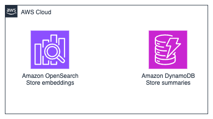

# Meta Knowledge Retrieval for Knowledge Bases - Implementation

This proof-of-concept implements the knowledge base proposed in ["Meta Knowledge for Retrieval Augmented Large Language Models"](https://www.amazon.science/publications/meta-knowledge-for-retrieval-augmented-large-language-models), transforming traditional RAG systems into an advanced **prepare-then-rewrite-then-retrieve-then-read** framework for domain expert-level knowledge base understanding.

## Implementation Overview

This implementation demonstrates a novel data-centric RAG workflow that, according to authors, significantly outperforms traditional document chunking approaches by:

- **Generating synthetic Q&A pairs** and metadata for each document chunk
- **Creating Meta Knowledge Summaries (MK Summary)** for document clusters  
- **Enabling personalized query augmentation** based on user perspective and role


### Meta Knowledge Retrieval Implementation

Core implementation of the research paper's methodology, featuring:

**Prepare-Rewrite-Retrieve RAG Architecture**
- **Prepare**: Documents are processed with metadata extraction and synthetic Q&A generation
- **Rewrite**: User queries are augmented using synthetic question matching and meta knowledge
- **Retrieve**: Enhanced retrieval using perspective-based knowledge bases
- **Read**: LLM generates responses with improved breadth, depth, relevancy, and specificity

**Prepare-Rewrite-Retrieve Processing Pipeline**
1. Documents are partitioned into chunks and analyzed
2. Synthetic question-answer pairs are generated for each chunk using LLMs
3. Metadata is extracted to enable multi-perspective retrieval
4. Meta Knowledge Summaries (MK Summary) are created for document clusters
5. All components are indexed into searchable vector embeddings
6. Upon querying the RAG the query can answered from one or multiple perspectives
7. For each answering perspective the query is augmented with the meta knowledge summary corresponding to the perspective
8. The RAG flow continues as usual


## Test the prepare-rewrite-retrieve knowledge base approach

We provide a set of Jupyter notebooks with a reference implementation of the **prepare-rewrite-retrieve** approach. Follow the instructions in the notebooks:


* [notebooks/DataIndexing.ipynb](notebooks/DataIndexing.ipynb)
* [notebooks/PrepareRewriteRetrieveRAG.ipynb](notebooks/PrepareRewriteRetrieveRAG.ipynb)


to create and test a **prepare-rewrite-retrieve** knowledge base

## Deploy the infrastructure (Optional)

Optionally, you can provision an AWS OpenSearch Serverless vector collection and a DynamoDB table to store the knowledge base and meta-knowledge summaries respectively.

Should you choose to test the knowledge base with AWS infrastructure you must execute the notebooks:

* [notebooks/DataIndexingWithInfra.ipynb](notebooks/DataIndexingWithInfra.ipynb)
* [notebooks/PrepareRewriteRetrieveRAGWithInfra.ipynb](notebooks/PrepareRewriteRetrieveRAGWithInfra.ipynb)

### Prerequisites

Before deploying, ensure you have:

- **AWS CLI** configured with appropriate permissions
- **Docker** installed and running
- **Python 3.12+** with pip
- **A CDK bootstrapped** AWS account
- **A Python virtual environment** with the dependencies installed

### Install Dependencies

Install UV package manager and create a virtual environment with the required packages:

```bash
# Install UV (if not already installed)
# On macOS:
brew install uv
# Or using pip:
# pip install uv

# Create virtual environment and install dependencies
uv venv

# Activate virtual environment
# On macOS/Linux:
source .venv/bin/activate
# On Windows:
# .venv\Scripts\activate

# Install dependencies using UV
uv pip install -r requirements.txt
```

Since this stack pulls Docker images from the [AWS ECR Public registry](https://docs.aws.amazon.com/AmazonECR/latest/public/public-registry-auth.html) you need to log in into it.

```
aws ecr-public get-login-password --region us-east-1 | docker login --username AWS --password-stdin public.ecr.aws
```

### Deployment of the infrastructure

You are now ready to deploy the resources. You can do so by running:

```bash
cd cdk

# Deploy with required parameters
cdk deploy MetaKnowledgeRetrieval \
  --require-approval=never
```

The CDK stack will deploy the following resources



### Add OpenSearch permissions to the role executing the notebooks

To interact with the OpenSearch Serverless collection the role you will be using to execute the notebooks must have the permissions specified here: [https://docs.aws.amazon.com/opensearch-service/latest/developerguide/serverless-data-access.html](https://docs.aws.amazon.com/opensearch-service/latest/developerguide/serverless-data-access.html)

### Stack Outputs

After successful deployment, you'll receive:

- **DynamoDB Table Names** - Job tracking and metadata storage
- **OpenSearch Collection Endpoint** - Vector search capabilities 

### Verify Deployment Status
```bash
aws cloudformation describe-stacks --stack-name MetaKnowledgeRetrieval
```

## Troubleshooting

### Common Issues

**CDK Bootstrap Required**
```bash
cdk bootstrap
```

**Docker Not Running**
- Ensure Docker is running for Lambda packaging
- Check Docker daemon status

**IAM Permissions**
- Verify AWS credentials have sufficient permissions
- Check CloudFormation, DynamoDB, OpenSearch permissions

**Region Consistency**
- Ensure all resources deploy to the same AWS region
- Check AWS CLI default region: `aws configure get region`

### Resource Limits

Be aware of these AWS service quotas:
- OpenSearch Serverless collections per account
- DynamoDB read/write capacity

### Support

For issues or questions:
1. Check CloudFormation events for detailed error messages
2. Review CloudWatch logs for Lambda function errors
3. Verify all prerequisites are met

## Cleanup

To remove all resources:

```bash
cdk destroy MetaKnowledgeRetrieval
```